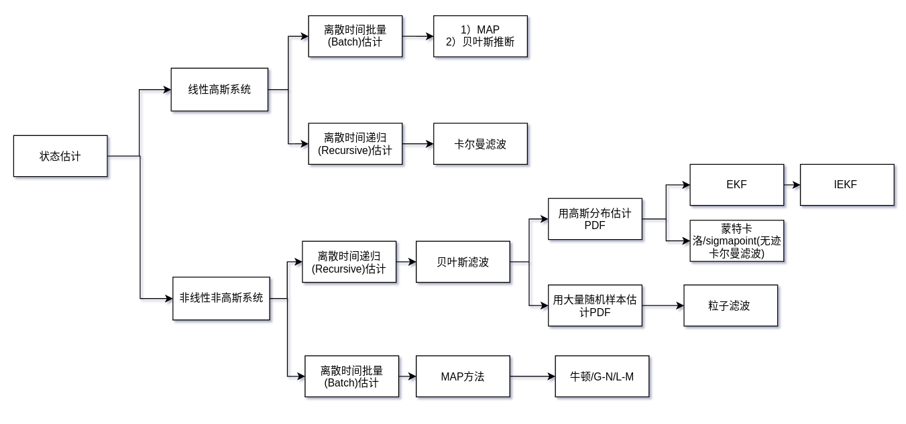

> 起因于一次技术分享，也是对之前一段时间学习的总结>_<

# 0. 什么是SLAM？

Simultaneous Localization and Mapping

搭载1)一种或几种传感器的运动主体在2)没有环境先验信息的情况下，在运动过程中实时估计自身运动并建立环境模型。

    SLAM问题的本质就是状态估计。

                                                                                                                                        --高翔

# 1. 状态估计问题

> 状态估计就是根据系统的先验模型和测量序列，对系统内在状态进行重构的问题。

**状态估计问题**：在k个时间点上，已知1）初始状态信息x0，2）观测数据y0，3）输入v1，以及4）系统运动模型和观测模型，计算系统真实状态xk

**分类**：

•系统是否为线性的？线性系统/非线性系统

•噪声是否为高斯的？高斯系统/非高斯系统

•问题是批量式还是递归式？Batch/Recursive方法

•是连续的还是离散的？（这里不讨论连续时间估计）

<figure>

</figure>

<!-- 
 -->

## 1.1 线性高斯系统(Linear Gaussian)

### 1.1.1 离散时间批量估计

先考虑最简单的批量线性高斯系统：
**运动方程**：

<figure>

</figure>

**观测方程**：

<figure>

</figure>

批量：一次性使用所有数据。

------

#### 1.1.1.1 MAP法

已知输入v和观测y，求最大概率状态：

<figure>
 

</figure>

根据贝叶斯公式：(分母与x无关，舍去，v在x已知的情况下与观测无关，也省略)

<figure>

</figure>

因式分解，取对数：

<figure>
 

</figure>

**==> 一个无约束最小二乘问题**

通常把先验、输入和观测等所有时刻的已知数据放在一个向量z里， z = Hx + W：

<figure>

</figure>

然后可以得到我们更熟悉的目标函数形式：

<figure>

</figure>

求其最小值，只要令自变量导数为零：

<figure>

</figure>

Cholesky分解等…求解**Ax=B**。

    - MAP只关心达到最大后验概率的一个点，这个点的状态称为MAP估计

    - 还可以通过贝叶斯推断求解LG系统离散时间批量估计问题，其结果与MAP方法一致

    - 最优解等价于让一个弹簧阻尼系统处于最小能量状态。

#### 1.1.1.2 贝叶斯推断：

<figure>

</figure>

> 可计算状态的先验均值与协方差，从而得到与MAP一致的Ax=B形式。
>
> 在线性高斯系统中，贝叶斯推断结果与MAP结果一致

---

### 1.1.2 离散时间递归估计

批量估计使用能用到的所有数据，估计所有时刻的状态，即使用了来自未来的数据估计过去的信息。

为了满足实时性的需求，需要限定当前时刻的状态只由其之前时刻的信息决定。

**==> 卡尔曼滤波**

> 马尔科夫假设：当前时刻的状态只于前一时刻有关。

<figure>

</figure>

                                              当前估计 = 上一时刻估计 + K * (当前测量 - 上一时刻估计)

<figure>

</figure>

> - 对于噪声是高斯的线型系统，卡尔曼滤波是最优线性无偏(E(x)=x)估计。（无偏且方差最小）
>
> - 需知道初始状态。

## 1.2 非线性非高斯系统
现实世界中的系统大多是非线性非高斯

<figure>

</figure>

### 1.2.1 离散时间递归估计

#### 1.2.1.1 贝叶斯滤波

    由贝叶斯推断得来

    假设各个时刻的输入和观测都是独立的。

    当前状态xt只与上个时刻状态xt−1以及与控制vt有关。

在**批量**估计方法中，使用PDF刻画当前状态有：

<figure>
 

</figure>

在**递归**的估计方法中，我们假设了当前状态xt只与上个时刻状态xt−1有关，因此在上式第二项中引入前一时刻状态：

<figure>

</figure>

带入批量估计的结论，因为马尔科夫性，有：

<figure>

</figure>

**缺点**：除了线性高斯情况，实际应用场景难以实现

**原因**：

    1）PDF是一个连续的函数，需要无限多参数才能完全表示。---对后验PDF近似为高斯/使用有限数量的随机样本近似。

    2）积分计算十分耗时。---对积分进行近似：对运动模型和观测模型线性化/通过样本近似描述PDF（粒子滤波）

---

#### 1.2.1.2 EKF
在贝叶斯滤波的基础上：

1）假设状态分布(后验置信度)和噪声为高斯分布；

<figure>
 

</figure>

2）对运动模型和观测模型进行线性化；

<figure>

</figure>

其中：

<figure>

</figure>

将线性化后的结果带入贝叶斯滤波：

<figure>

</figure>

EKF的过程基本与KF相同：

<figure>

</figure>

**缺点**：

    1）不一定收敛

    2）收敛时也可能有偏；

    3）线性化点在估计状态的均值处，可能离真值较远；

---

#### 1.2.1.3 IEKF

> 将线性化点设置为后验均值并不断迭代，将上一次的迭代结果作为下一次的线性化

<figure>
 

</figure>

**EKF/IEKF/MAP**：

    1）EKF由于只进行了一次线性化，相当于只迭代了一次的IEKF。由于没有迭代，因此其结果并不一定时局部极大值

    2）IEKF在最优估计处迭代地进行线性化，其估计结果等同于MAP的解。

    3）IEKF和MAP解优于EKF

例：FAST-LIO使用IEKF融合雷达里程计结果(观测)与IMU结果(运动)。

<figure>

</figure>

---

#### 1.2.1.4 粒子滤波PKF

    1）是唯一可以处理非高斯噪声的可实际应用的方法。

    2）不需要知道运动方程和观测方程的具体解析表达式。

    3）通过粒子群的随机采样，对系统状态分布进行近似的滤波方法。

**流程：**

1.采样：从先验与运动噪声中采样M个样本：

<figure>

</figure>

2.使用运动方程得到预测分布:

<figure>

</figure>

3.使用观测方程进行校正:

计算每个粒子的权重：

<figure>

</figure>

对粒子进行重要性重采样（Sample importance resampling）：

<figure>
 

</figure>

---

#### 1.2.1.5 无迹卡尔曼滤波UKF
不进行线性化，通过采样的数据计算PDF的概率密度

<figure>

</figure>

---

### 1.2.2 离散时间批量估计

1）构建运动与观测的误差，

<figure>

</figure>

2）优化误差的马氏距离，

<figure>

</figure>

3）求解无约束最优化问题

<figure>

</figure>

**梯度下降法**

<figure>

</figure>

> gk表示沿负梯度方向，以a为步长，进行一阶泰勒逼近。

**Newton**

<figure>

</figure>

> 使用Hessian矩阵代替步长，保留泰勒展开的一阶和二阶项，收敛快，但需计算Hessian阵。

**Gauss-Newton**

<figure>

</figure>

> 使用雅可比矩阵近似Hessian矩阵，提高计算效率。但可能存在H阵奇异导致无法迭代。

**L-M**

<figure>

</figure>

> 加入信赖域概念，解决H矩阵不满秩或非正定情况。

<figure>

</figure>

# 2. 激光SLAM

<figure>

</figure>

误差与目标函数为：

<figure>
 

</figure>

## 2.1 LO

<figure>

</figure>

### 2.1.1 特征提取与关联

**LOAM类特征**：

根据前后各5个点与当前点的长度(长度指激光点到雷达的距离),计算曲率大小

<figure>

</figure>

loam中将特征根据曲率分为四类

    sharp:     曲率特别大的点
    less_Sharp:曲率大的点
    flat:      曲率特别小的点
    less_flat: 曲率小的点

**特征关联：**
假设第k+1帧到第k帧的相对位姿为：

<figure>

</figure>

第k+1帧中的一点p转到第k帧：

                                                                                               p'=Rp+t

**线特征：**
当点p为sharp类型的点时，在上一帧（第k帧）搜索离p'最近的线特征点，并在其相邻的扫描线上再找一个线特征点。

<figure>

</figure>

用点p'到直线ab的距离构造残差项：

<figure>

</figure>

**面特征：**
当点为flat类型时，在上一帧（第k帧）搜索离p'最近的面特征点，并在其相邻的扫描线上再找两个面特征点组成平面。

<figure>

</figure>

用点p到平面mjl的距离构造残差项：

<figure>

</figure>

待估计的位姿可以从求解这个非线性优化方程得出：

<figure>

</figure>

其他类型特征：面元/语义/

### 2.1.2 去畸变

[Motion Compensation](https://printeger.github.io/posts/Motion-Compensation/)

[CODE]()

## 2.2 传感器融合

> 状态估计可以解决如何使用已有的传感器信息的问题。

### 2.2.1 传感器分类：

**内感受型**(interceptive)：测量运动主体速度和加速度。加速度计、陀螺仪、轮速计…

**外感受型**(exteroceptive)：测量运动主体位置和朝向。相机、雷达、GPS…

大多数情况下，同时使用内感受型和外感受型的传感器的状态估计会有更好的效果。

### 2.2.2 基于滤波的融合

#### 2.2.2.1 LiDAR+IMU

**FAST-LIO/faster-LIO**类算法，使用IEFK融合Lidar和IMU。

因为IMU频率更高，所以通常使用IMU姿态作为预测，Lidar作为观测用来矫正。

**INPUT：**

1）第k-1次估计的后验状态及其协方差矩阵：

<figure>

</figure>

2）当前帧的Lidar特征点：

<figure>

</figure>

3）当前帧IMU数据：

<figure>

</figure>

**Algorithm**:

1）IMU预积分 ==> 当前时刻状态的先验与其协方差：

<figure>

</figure>

2）运动补偿：使用IMU对Lidar特征进行运动补偿，得到补偿后的特征：

<figure>

</figure>

3）迭代：迭代n次，n=0时，使用先验作为迭代初值。

<figure>

</figure>

4）计算后验：

<figure>

</figure>

**OUTPUT**:

第k次的后验均值与协方差矩阵：

<figure>

</figure>

**特点：**

> 1）状态量设计较为便捷，可以将Lidar到IMU的外参矩阵也设为状态量进行优化，实现外参实时标定。
>
> 2）计算速度快，是MAP估计(因为用了IEKF在后验均值处迭代)。

[CODE]()

#### 2.2.2.2 GPS+IMU

    这里采用了ESKF(Error State Kalman Filter)进行两者融合。

    与其他KF方法不同的是，它估计的状态量不是速度位姿等，而是这些状态量的误差。

**优点：**

> 1）线性化是总是在0附近，不会像EKF等一样离线性化工作点太远导致近似不够。
>
> 2）其状态变量为一个小量，其高阶形式可以忽略，便于近似。
> 
> 3）对于旋转，优化失准角，只需三个维度即可表达，而传统需要4维(四元数)或9维(旋转矩阵)。
>
> 4）误差状态变量的更新步骤也更简单。

**状态变量真值 = 名义状态变量 + 误差状态变量**

<figure>

</figure>

**运动方程：连续 ==> 离散**

<figure>
 

</figure>

根据上式可以得到线性化后的运动方程的：

<figure>

</figure>

F为线性化后的雅可比矩阵：

<figure>

</figure>

**观测方程：**

观测来自GPS，在该应用场景中，我们将观测量(也是一个误差项)定义为先验预测的位置与GPS测量之间的误差。

<figure>

</figure>

由于观测方程是线性的，只于位置有关，所以易得H形式为：

<figure>

</figure>

**更新：**

<figure>

</figure>

**预测：**

<figure>

</figure>

**计算名义状态变量**

修正了误差状态的估计。接下来，只需把误差状态归入名义状态，即可。

<figure>

</figure>

然后重置ESKF：

<figure>
 

</figure>

CODE: https://bitbucket.org/naiguixiao/inno_gio/src/master/ 

#### 2.2.2.3 LiDAR+IMU+GPS

[TODO]()

<figure>

</figure>

#### 2.2.2.4 使用优化的融合方案：

[R2live](https://github.com/hku-mars/r2live)

<figure>

</figure>

使用因子图优化来优化图像关键帧滑动窗口内的相机姿态和视觉landmark是为了：

1）进一步提高视觉地标和关键帧姿态的质量；

2）同时校准相机和LiDAR-IMU子系统之间的时间偏移，我们利用因子图优化来优化图像关键帧滑动窗口内的相机姿态和视觉地标

## 2.3 挑战与趋势

**挑战**：

1）特殊场景下面临特征缺失问题。（如隧道）

2）动态物体较多场景下如何避免动态物体造成的影响。

3）地图重用，SLAM建立的地图如何为其他功能提供有用的信息？
4）多传感器融合部分如何优化。

**趋势**：

1）与深度学习结合的语义SLAM：SuMa++等。

2）更新颖易用的地图表示：SLAMesh

3）独立多机(LiDAR)协同的SLAM：CoSLAM

4）连续时间的SLAM（STEAM）